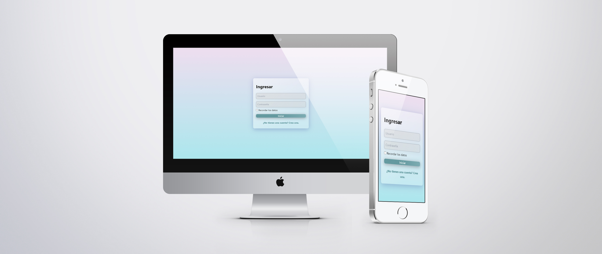

<h1 align="center"> Login App</h1>
<div align="center">
  <h3>
    <a href="https://gustavo-exe.github.io/LoginApp/">
      Demo
    </a>
  </h3>
</div>

# React App
Construido con react [Create React App](https://es.reactjs.org/docs/create-a-new-react-app.html).
## Acerca del proyecto
El estilo **Glassmorphism**, se lleva toda la atencion en este proyecto construido con componentes react.
## Responsive Mockup


## Antes de empezar
1. Necesitas tener instalado:
    * NodeJs (La version LTS)
    * Git 
    * Clonado el repositorio

2. Abrir el folder del repositorio en tu linea de comandos y instalar las dependencias:

```bash
npm install
```
3. Iniciamos el servidor local, para estar trabajando y los cambios se vean reflejados.
```bash
npm start
```